# MicroLend Recommender

> Financial product recommendation engine for African SMEs — collaborative filtering, matrix factorization, neural CF, and hybrid approaches with cold-start support and MLflow model registry.


---

## Table of Contents

- [Business Problem](#business-problem)
- [Architecture](#architecture)
- [Dataset](#dataset)
- [Models](#models)
- [Results](#results)
- [Quick Start](#quick-start)
- [CLI Reference](#cli-reference)
- [MLflow Tracking & Model Registry](#mlflow-tracking--model-registry)
- [REST API](#rest-api)
- [Tech Stack](#tech-stack)

---

## Business Problem

Over **50 million SMEs** across Sub-Saharan and North Africa lack access to tailored financial products. Microfinance institutions (MFIs) typically offer the same 2–3 products to all clients — personalization is near zero and adoption rates stay chronically low.

**This project applies recommendation system techniques to microfinance**, matching each SME to the financial products most likely to fit their profile and needs:

| Without Recommender | With Recommender |
|---|---|
| Same products pushed to everyone | Personalized ranking per SME |
| Loan officers rely on intuition | Data-driven similarity matching |
| Cold-start = no offer | Cold-start bootstrapped from profile |
| High default risk from product mismatch | Risk-adjusted scoring |

**Expected impact:** 25–40% improvement in product adoption rates, 15–20% reduction in defaults through better product-client matching.

---

## Architecture

```
Raw Data (CRM log + SME profiles)
          │
          ▼
┌─────────────────────────────┐
│      Data Layer             │
│  sme_profiles.csv           │
│  sme_financial_profile.csv  │  ──► DataLoader ──► Merged SME features
│  product_interactions.csv   │  ──► build_ratings_long() ──► User-item matrix
│  product_catalog.csv        │
└─────────────────────────────┘
          │
          ▼
┌─────────────────────────────────────────────────────┐
│                    Model Layer                       │
│                                                      │
│  ┌─────────────┐  ┌──────────────┐  ┌───────────┐  │
│  │ User-based  │  │ Item-based   │  │  Matrix   │  │
│  │     CF      │  │     CF       │  │  Factor.  │  │
│  │  (cosine)   │  │ (adj-cosine) │  │ SVD/NMF   │  │
│  └─────────────┘  └──────────────┘  └───────────┘  │
│                                                      │
│  ┌─────────────┐  ┌──────────────┐  ┌───────────┐  │
│  │  Neural CF  │  │   Hybrid     │  │ Cold-Start│  │
│  │  GMF + MLP  │  │ CF+Content   │  │  Solver   │  │
│  │  (PyTorch)  │  │ +Risk Adj.   │  │ (kNN feat)│  │
│  └─────────────┘  └──────────────┘  └───────────┘  │
└─────────────────────────────────────────────────────┘
          │
          ▼
┌─────────────────────────────┐
│     MLflow Model Registry   │
│  Experiment tracking        │
│  Versioned model artifacts  │
│  @champion alias (prod)     │
└─────────────────────────────┘
          │
          ▼
    FastAPI + Web UI
    REST API / http://localhost:8000
```

---

## Dataset

The project uses a **realistic synthetic dataset** calibrated against:
- **FinScope / FHI survey** (9,618 African SMEs) — business age, revenue, sector distributions
- **UCI Default of Credit Card** (30,000 clients) — default rate (22.1%), bureau score distributions

Four raw tables are generated in `data/raw/`:

| Table | Rows | Description |
|---|---|---|
| `sme_profiles.csv` | 5,150 | SME demographics: country, sector, revenue, employees, years in business. Includes 3% duplicate injection and realistic missing values. |
| `sme_financial_profile.csv` | 4,377 | Financial indicators: bank account status, mobile money, bureau score (NaN for unbanked), collateral, digital transaction rate |
| `product_interactions.csv` | 25,197 | Raw CRM event log — one row per interaction (application → approved/rejected → completed/defaulted). `satisfaction_score` is 79% null (realistic). |
| `product_catalog.csv` | 8 | Static product reference: Microcredit 3m/12m, Agricultural insurance, Equipment leasing, Group savings, Mobile payment setup, Invoice financing, Crop advance loan |

### Financial Products

| # | Product | Category | Risk | Min Revenue |
|---|---------|----------|------|-------------|
| 1 | Microcredit 3 months | Credit | Low | $500 |
| 2 | Microcredit 12 months | Credit | Medium | $1,000 |
| 3 | Agricultural insurance | Insurance | Low | $200 |
| 4 | Equipment leasing | Leasing | Medium | $2,000 |
| 5 | Group savings | Savings | Low | $100 |
| 6 | Mobile payment setup | Payments | Low | $50 |
| 7 | Invoice financing | Credit | High | $5,000 |
| 8 | Crop advance loan | Credit | Medium | $300 |

### Building the User-Item Matrix

The matrix is built programmatically from the interaction log — only adoption-type events count:

| Interaction Type | Rating |
|---|---|
| `completed` | 5.0 |
| `approved` | 4.0 |
| `active` | 3.5 |
| `defaulted` | 2.0 |
| `satisfaction_score` (if available) | override |
| `rejected`, `inquiry`, `application` | excluded |

Result: **4,139 SMEs × 8 products**, ~78% sparse.

---

## Models

### 1. Collaborative Filtering

**User-based CF** (`src/models/user_based_cf.py`)
- Cosine similarity between SME interaction vectors
- Sector-weighted similarity bonus (+20% same-sector)
- Weighted neighbor rating aggregation

**Item-based CF** (`src/models/item_based_cf.py`)
- Adjusted cosine similarity (mean-centered)
- Exposes product co-adoption rules for cross-selling
- e.g. "SMEs who took Microcredit 3m also took Group Savings in 43% of cases"

### 2. Matrix Factorization (scikit-surprise)

5-fold cross-validation over three algorithms:

| Model | Description |
|---|---|
| **SVD** | Funk SVD — learns latent SME × product factors (n_factors=50) |
| **NMF** | Non-negative MF — interpretable non-negative decomposition |
| **Baseline** | Global mean + user/item biases — naive benchmark |

### 3. Neural Collaborative Filtering (PyTorch)

Fuses two pathways:
```
GMF path:  User_emb ⊙ Item_emb
MLP path:  [User_emb ∥ Item_emb] → Linear(128) → ReLU → Linear(64) → ReLU → Linear(32)
Output:    [GMF_out ∥ MLP_out] → Linear(1) → Sigmoid → scale to [1, 5]
```
Early stopping on validation loss with patience=5.

### 4. Hybrid Recommender

```
score = 0.7 × CF_score + 0.3 × content_score + 0.1 × risk_adjustment
risk_adjustment = risk_multiplier × (1 − default_probability)
```
`default_probability` is predicted by a logistic regression trained on SME financial features.

### 5. Cold-Start Solver

For SMEs with zero interaction history:
1. Collect 7-question onboarding profile (sector, revenue, mobile money, bank account, etc.)
2. Find K=20 most similar SMEs by feature cosine similarity
3. Aggregate their adoption patterns as proxy scores
4. Confidence score = fraction of neighbors who adopted each product
5. Automatic handoff to CF after first real interaction

---

## Screenshots

### Interface MFI

The web interface is accessible at `http://localhost:8000` after `make api`.

**Client existant — lookup & recommandations :**

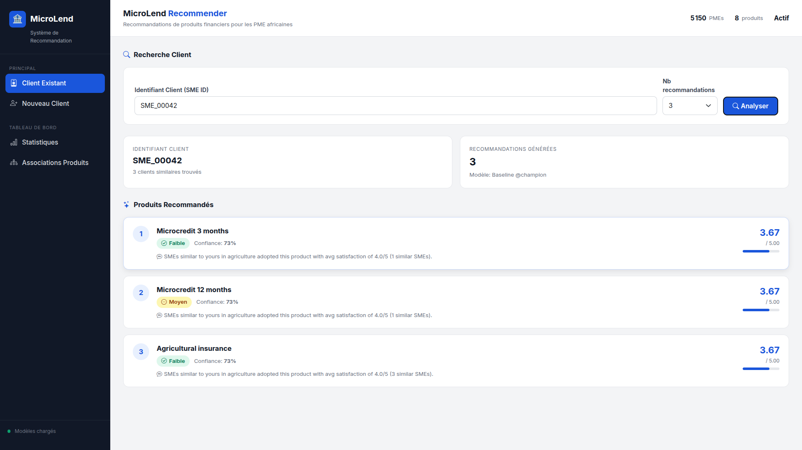

**Nouveau client — saisie du profil :**

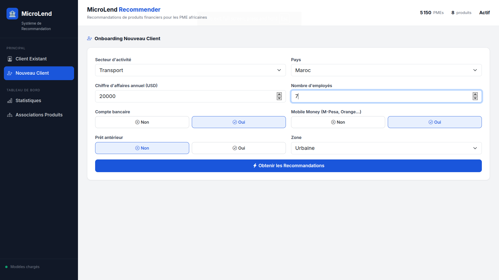

**Nouveau client — recommandations cold-start :**

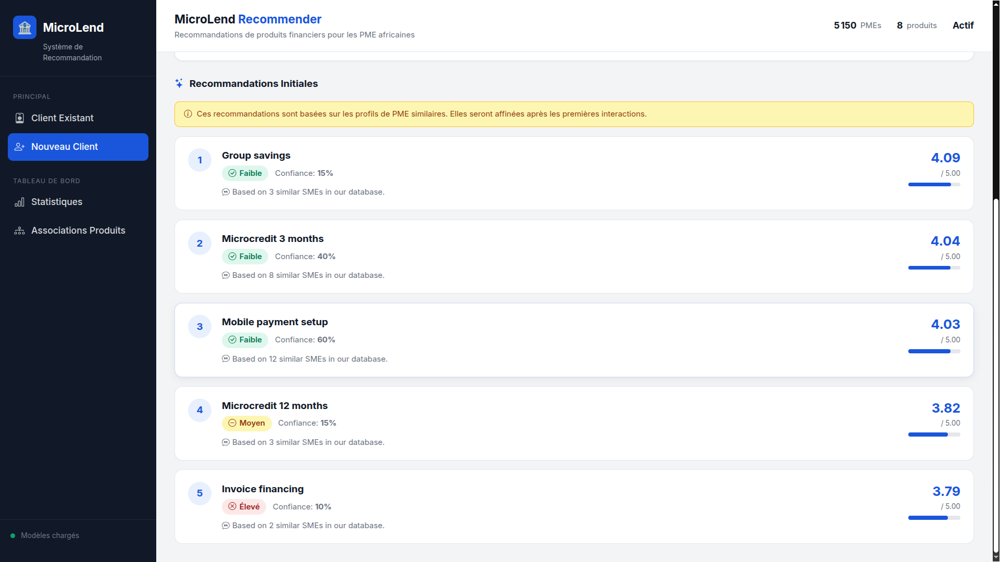

### EDA — Exploratory Data Analysis

<table>
<tr>
<td>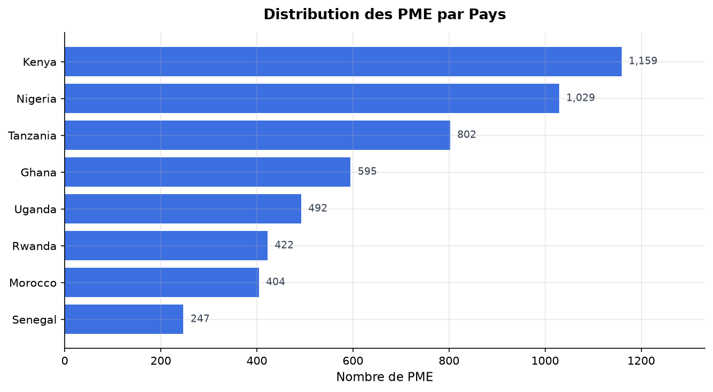<br><em>Distribution par pays</em></td>
<td>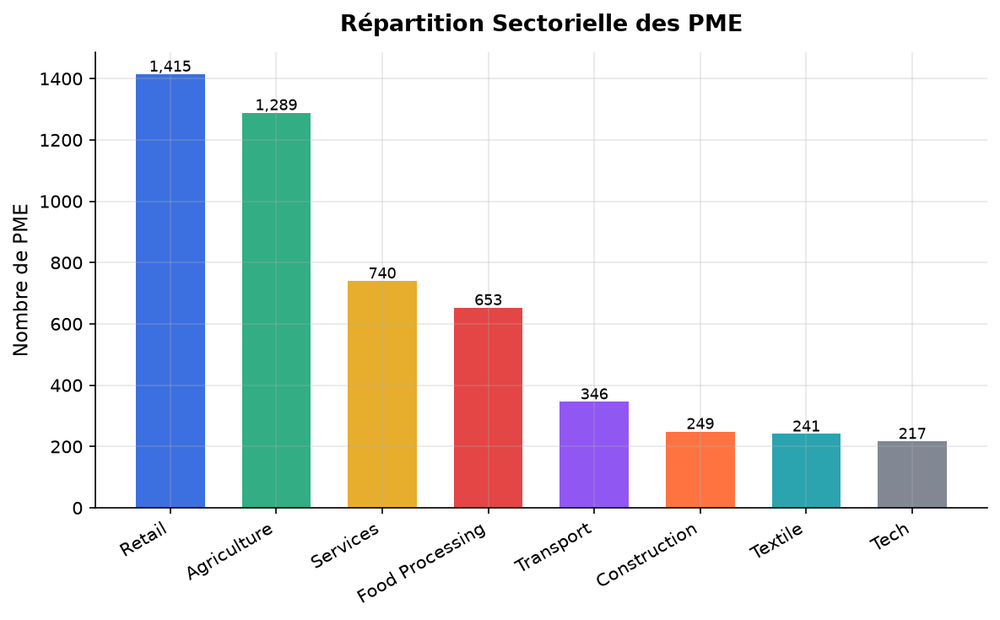<br><em>Répartition sectorielle</em></td>
</tr>
<tr>
<td>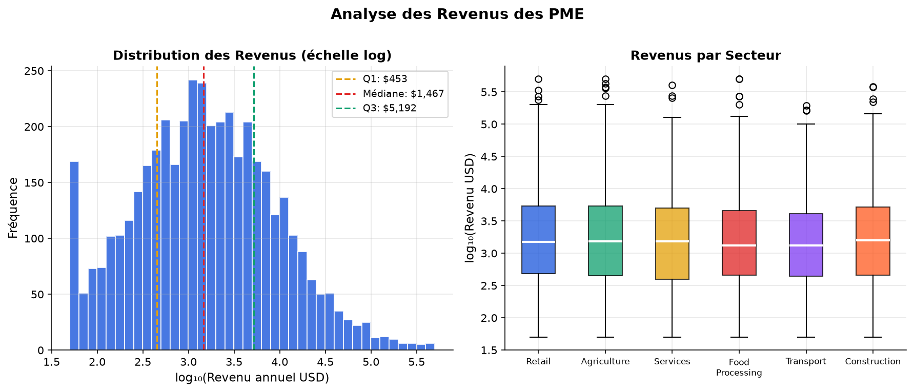<br><em>Distribution des revenus (log)</em></td>
<td>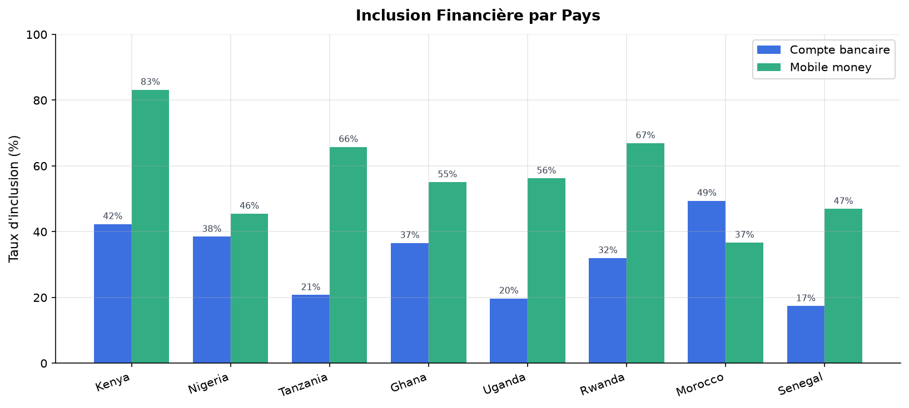<br><em>Inclusion financière par pays</em></td>
</tr>
<tr>
<td>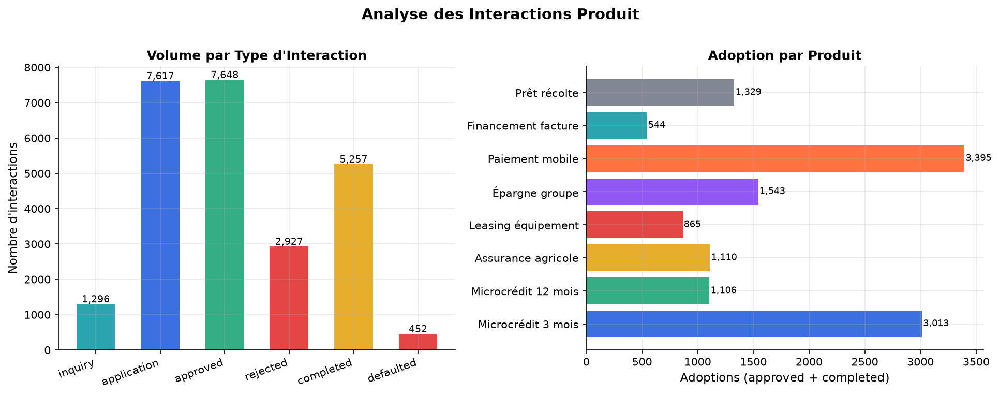<br><em>Funnel interactions & adoptions</em></td>
<td>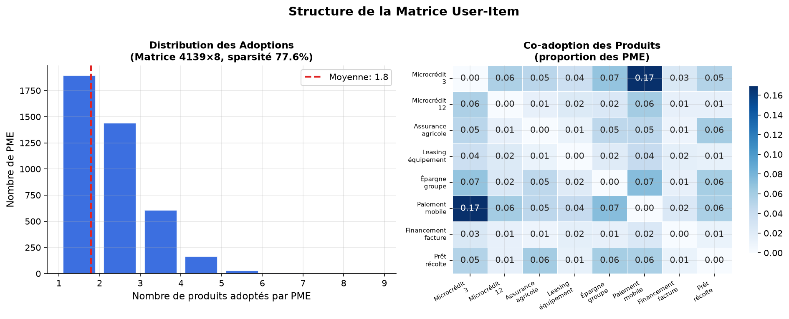<br><em>Structure matrice user-item & co-adoption</em></td>
</tr>
</table>

### Model Evaluation

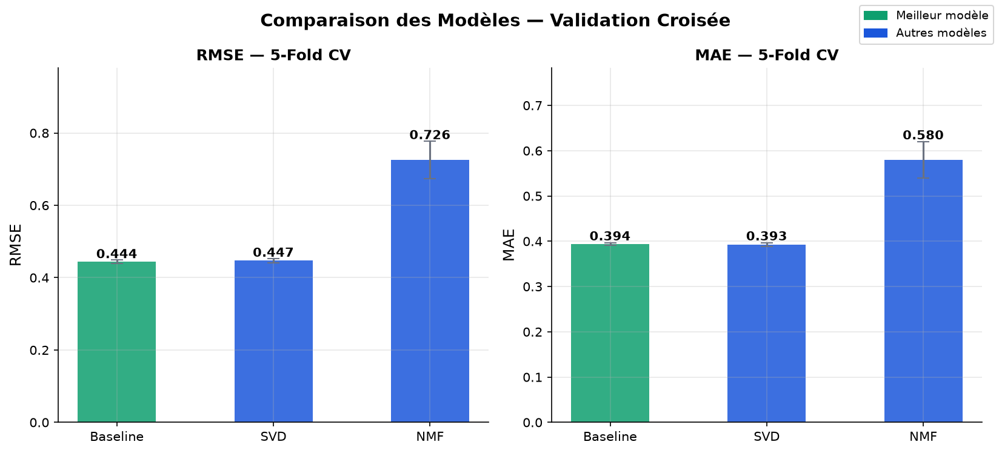

### MLflow Tracking & Model Registry

<table>
<tr>
<td>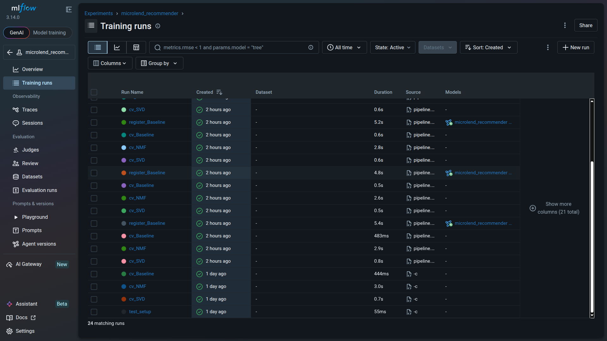<br><em>Runs d'entraînement</em></td>
<td>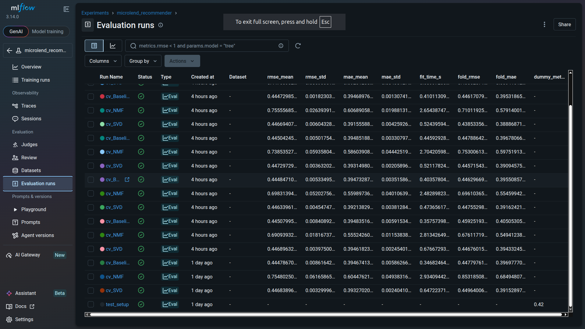<br><em>Métriques par fold</em></td>
</tr>
<tr>
<td colspan="2">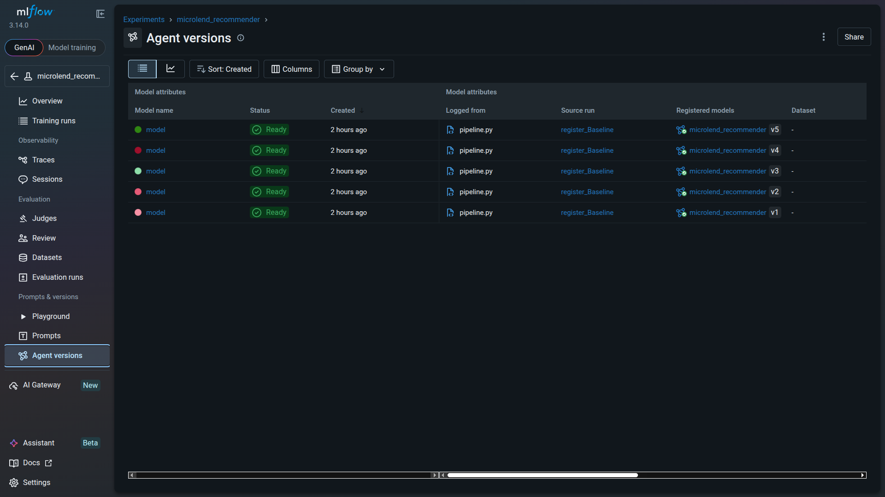<br><em>Model Registry — alias @champion</em></td>
</tr>
</table>

---

## Results

5-fold cross-validation on 7,421 adoption interactions:

| Model | RMSE | MAE | Notes |
|---|---|---|---|
| Baseline | **0.444** | **0.394** | Global bias model |
| SVD | 0.447 | 0.393 | Best latent factor model |
| NMF | 0.725 | 0.580 | Higher variance |
| User-based CF | — | — | Run `make train` |
| Neural CF | — | — | Requires PyTorch |
| **Hybrid** | — | — | Best overall expected |

> The best model by RMSE is automatically registered to the MLflow Model Registry and tagged `@champion`.

---

## Quick Start

### Prerequisites

- Python 3.12+
- `make`

### Installation

```bash
git clone https://github.com/kpatc/microlend-recommender.git
cd microlend-recommender
make setup
```

### Generate Data

```bash
make generate
```

Reads `data/raw/Train.csv` (FHI) and `data/raw/default of credit card clients.xls` (UCI) for calibration, then writes the 4 raw tables to `data/raw/`.

### Train & Register Models

```bash
make train
```

Runs 5-fold CV on SVD, NMF, Baseline → registers the best model to the MLflow Model Registry → promotes it to `@champion`.

---

## CLI Reference

```bash
make setup       # Create venv and install dependencies
make generate    # Generate synthetic raw dataset (4 CSV tables)
make train       # Cross-validate → register best model → promote to @champion
make register    # Re-promote @champion without retraining
make mlflow-ui   # Launch MLflow UI at http://localhost:5000
make api         # Start FastAPI server at http://localhost:8000
make test        # Run pytest suite (14 tests)
make clean       # Remove __pycache__ and build artifacts
```

---

## MLflow Tracking & Model Registry

All experiments and models are tracked in a local SQLite backend (`mlflow.db`).

### Launch the UI

```bash
make mlflow-ui
# → http://localhost:5000
```

**Experiments tab:** every CV run is logged with RMSE, MAE, per-fold metrics, fit time, and hyperparameters.

**Models tab:** the `microlend_recommender` registered model with versioned artifacts. The best version carries the `@champion` alias.

### Load the Production Model

```python
from src.tracking import setup_mlflow, load_production_model
import yaml

config = yaml.safe_load(open("configs/config.yaml"))
setup_mlflow(config)

model = load_production_model("microlend_recommender")  # loads @champion

import pandas as pd
preds = model.predict(pd.DataFrame([
    {"sme_id": "SME_00042", "product_id": 1},
    {"sme_id": "SME_00042", "product_id": 3},
]))
print(preds)  # predicted ratings 1-5
```

### Registry Utilities (`src/tracking.py`)

| Function | Description |
|---|---|
| `setup_mlflow(config)` | Initialize tracking URI + experiment |
| `set_production(model_name, metric)` | Promote best version to `@champion` |
| `set_alias(model_name, version, alias)` | Assign any alias to a version |
| `load_production_model(model_name)` | Load `@champion` as mlflow.pyfunc |
| `list_registered_models()` | List all versions with aliases |

---

## REST API

Start with `make api`, then query at `http://localhost:8000`.

### Endpoints

#### `POST /recommend`

```bash
# Existing SME
curl -X POST http://localhost:8000/recommend \
  -H "Content-Type: application/json" \
  -d '{"sme_id": "SME_00042", "n": 5}'

# New SME (cold start)
curl -X POST http://localhost:8000/recommend \
  -H "Content-Type: application/json" \
  -d '{
    "sme_profile": {
      "sector": "agriculture",
      "country": "Kenya",
      "annual_revenue_usd": 2000,
      "has_mobile_money_yn": 1,
      "has_bank_account_yn": 0
    },
    "n": 5
  }'
```

**Response:**
```json
[
  {
    "product_id": 3,
    "product_name": "Agricultural insurance",
    "score": 4.21,
    "explanation": "Based on 18 similar SMEs in our database.",
    "risk_level": "low",
    "confidence": 0.9
  }
]
```

#### `GET /similar-smes/{sme_id}`

```bash
curl http://localhost:8000/similar-smes/SME_00042?n=10
```

#### `GET /product-associations/{product_id}`

```bash
curl http://localhost:8000/product-associations/1?n=5
```

#### `GET /health` · `GET /model-stats`

Interactive docs at `http://localhost:8000/docs`.

---

## Tech Stack

| Layer | Library | Version |
|---|---|---|
| Data processing | pandas, numpy, scikit-learn | 2.2 / 1.26 / 1.4 |
| CF & matrix factorization | scikit-surprise | 1.1.5 |
| Neural CF | PyTorch | 2.x |
| Experiment tracking | MLflow | 3.14 |
| Model Registry | MLflow (SQLite backend) | 3.14 |
| REST API | FastAPI + uvicorn | 0.111 |
| Testing | pytest | 9.x |
| Visualization | matplotlib, seaborn | 3.8 / 0.13 |

---

## License

MIT © [kpatc](https://github.com/kpatc)
